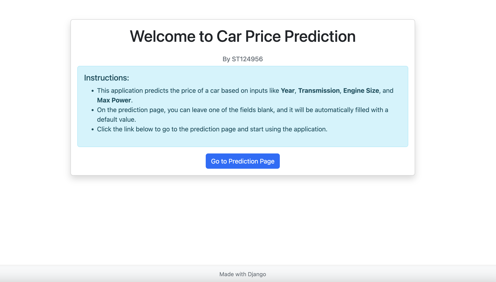
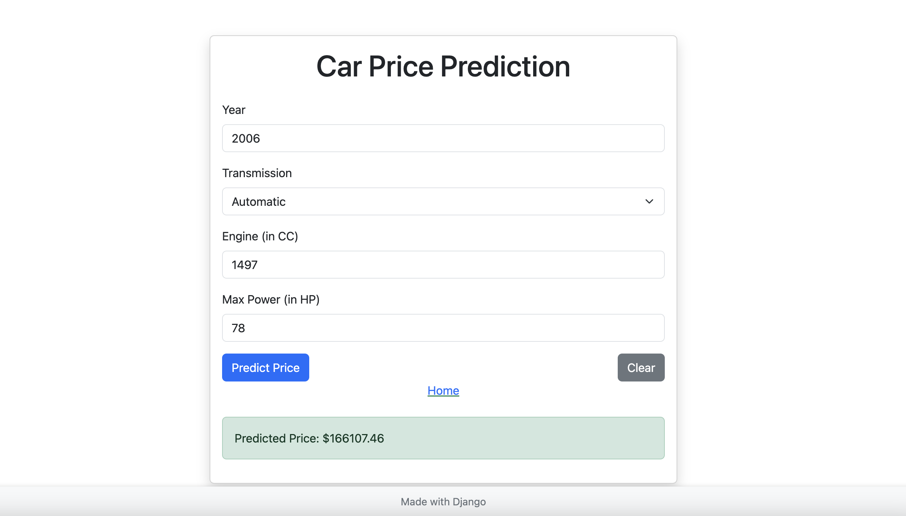

# A1. Car Price Prediction Project
### By Lu Htoo Kyaw (ST124956)

You can access the live website at http://54.255.189.239:8000/

This project predicts car prices using a Django-based web application integrated with a trained Random Forest Regressor model. It also includes Jupyter notebooks for exploratory data analysis (EDA) and model training. The entire setup is containerized with Docker for ease of deployment and reproducibility.

## Home Page



## Example Prediction



## Example Prediction without One Field


# Installation

## Clone the repository

```
git clone https://github.com/luhtookyaw/a1-car-price-prediction.git
```

## Install Python Packages
Go to app folder:

```
  cd app
```
```
  pip3 install -r requirements.txt
```

## Run Django Server In Local
Go to app folder:

```
  python3 manage.py runserver
```

## Build Docker Image From Scratch

Go to app folder:

```
  docker compose up -d
```

## Pull Image and Run
In root directory:

```
  docker compose up -d
```